# Kalajun Grassland Small Loop Trek
-Xinjiang, China

-2024 0711-0714

-60km

-backpacking

# Introduction
Kalajun Grassland, located in Xinjiang, is a stunning alpine meadow known for its vast, rolling hills, vibrant wildflowers, and panoramic views of snow-capped mountains. This pristine landscape is ideal for trekking, offering hikers a chance to experience untouched nature, local Kazakh culture, and herds of grazing livestock. This is my first time doing a heavy-load trek on the vast grasslands.

# Hiking
Around 8 PM Beijing time, my kind and beautiful friend, whom I've known for a long time, and I arrived at the trailhead, near a small cabin in the Tarim Scenic Area. It was about 6 PM in Xinjiang, so we were lucky enough to catch the sunset! We quickly set up our tent while there was still light. During that time, a little Kazakh boy stood a few meters away, watching us. After setting up the tent, I greeted him, and he shyly approached. We started chatting in a warm and friendly way, and soon became friends, sipping tea together under the sunset. It was such a joyful moment.

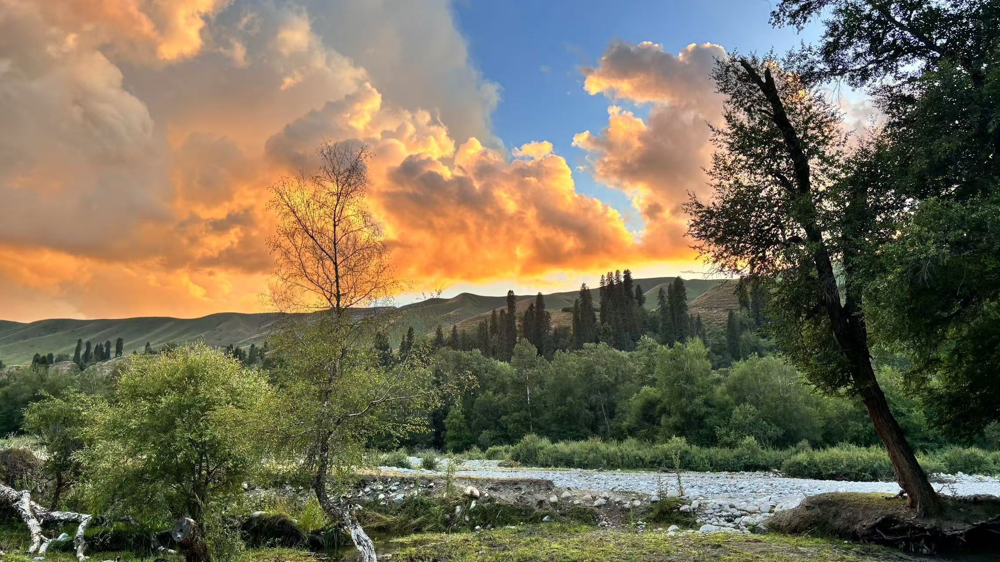

*
*the stunning sunset*
*

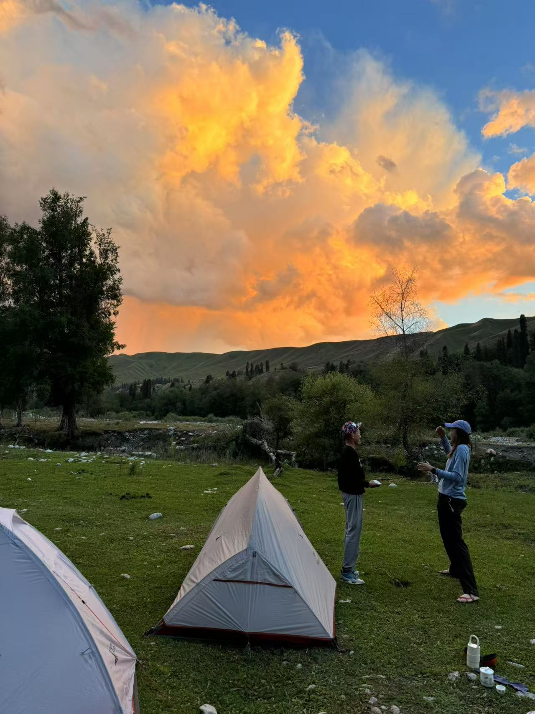

*
*Hamao and I enjoyed tea together, chatting happily under the sunset.*
*

The next morning, we set off from our hiking spot. Right from the start, we faced a steep incline, which was a bit challenging since we were both carrying heavy backpacks—about 15 kilograms each, I’d say. Then we entered a relatively open grassland, only to encounter another steep slope. With no shade on the prairie, the sun beat down on us, and we were hot and exhausted. Just before noon, we climbed up a big hill, and when we looked to the left, we were struck by the view—it was stunning! We had to stop and take some photos!

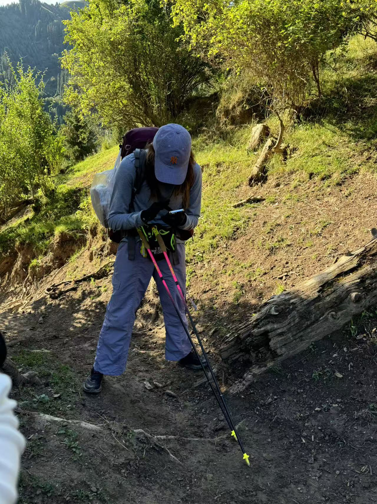

*
*After climbing the first steep slope, I felt a bit tired. I was taking a break and checking the offline map on my phone. This photo was taken by my sis secretly and she send it to me at the end hhh.*
*

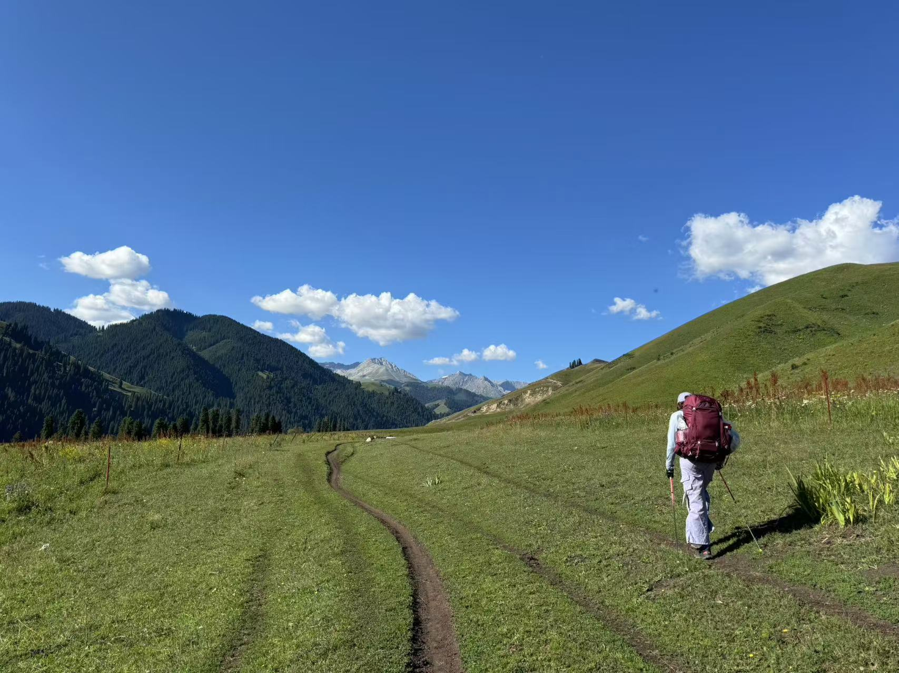

*
*an excited traveler*
*

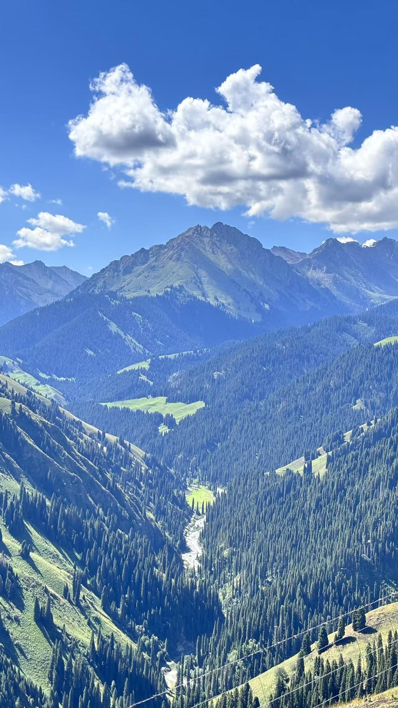

*
*Look! Over there!*
*

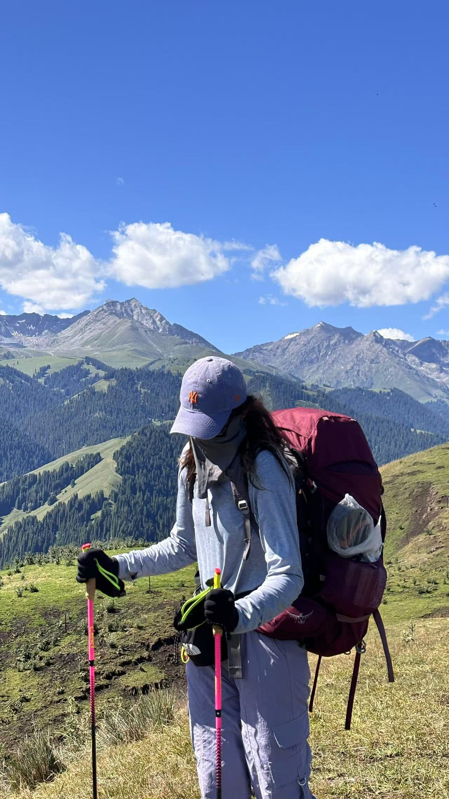

*
*"Hehe, let’s take a photo!"*
*

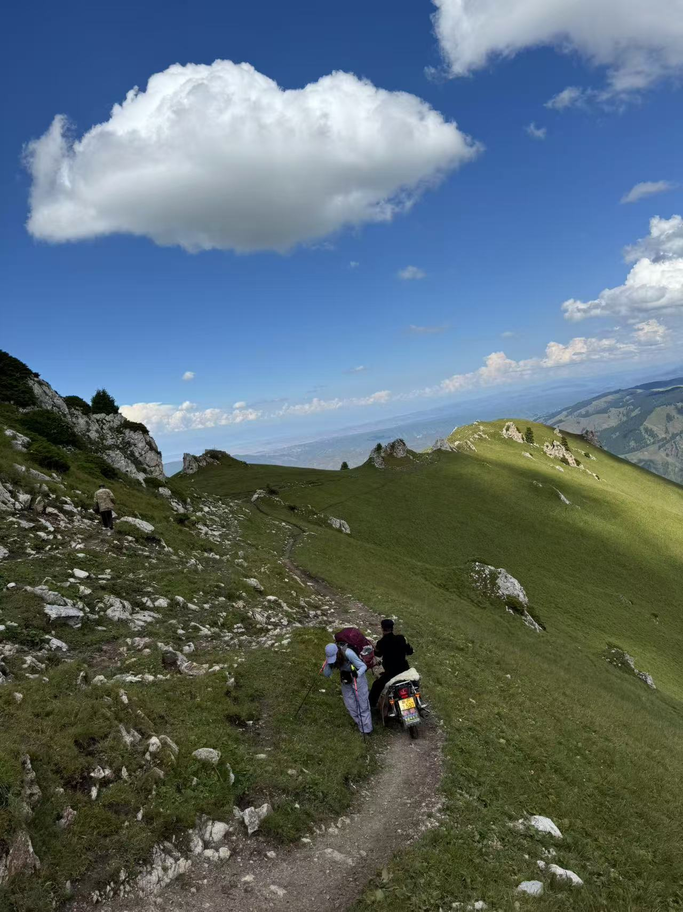

*
*This was taken by my sis when she thought I wasn’t looking. I was pleasantly surprised when I later saw this funny photo! At that moment, the path was so narrow that I had to give way to a Kazakh uncle on a motorcycle. You have no idea how tough that was for me!*
*

When we arrived at our first campsite, we were surprised to run into a few Kazakh guys we had met earlier on the trail. They were very welcoming and invited us to sing, dance, drink, enjoy lamb hot pot, and watch the local unique game of "scrambing for a sheep." One of the guys jokingly called it “the game of Xinjiang men,” which made us all laugh. 

I don’t usually drink, but while dancing with them, I felt like I was tipsy because I was so dizzy from all the spinning! The festivities went on until about 2 AM, and we reluctantly wrapped things up. Surprisingly, I woke up around 4 AM with a stomachache. When I opened the tent, the sky was filled with countless stars, and I could faintly see the Milky Way. I felt so lucky and was completely awestruck!

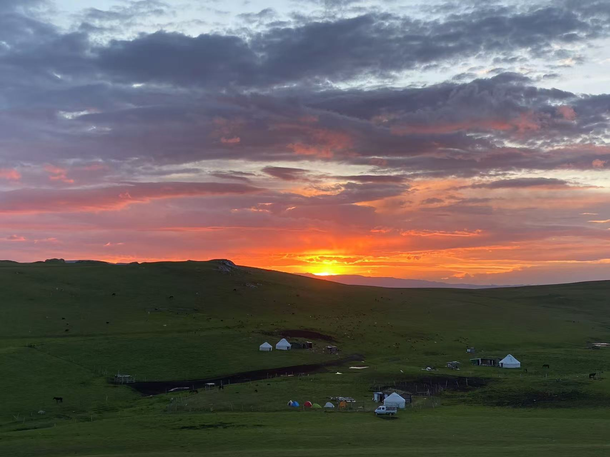

*
*We drank under the sunset, but I just watched and didn't drink.*
*

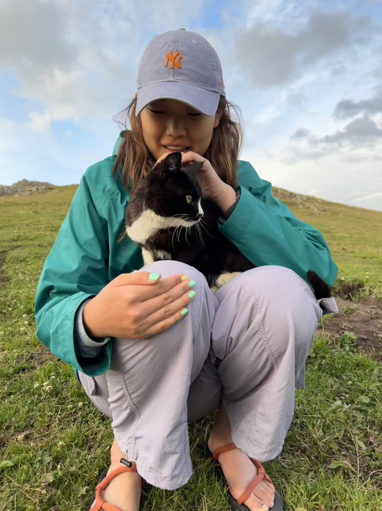

*
*A Kazakh guy placed a little kitten on my lap; it was so cute! I couldn’t help but pet it.*
*

I woke up early to the warmth of the sun and packed my things. After saying goodbye to the Kazakh guys, we continued on our journey. This day marked the real experience of hiking on the vast grassland, with countless little lambs and cows leisurely lying around. 

As I walked along a narrow path, I suddenly spotted a large group of unknown creatures approaching. Upon closer inspection, I realized it was a Kazakh guy on horseback herding sheep! I was lucky enough to experience the feeling of being surrounded by little lambs, some of them looked at me with surprise—hahaha!

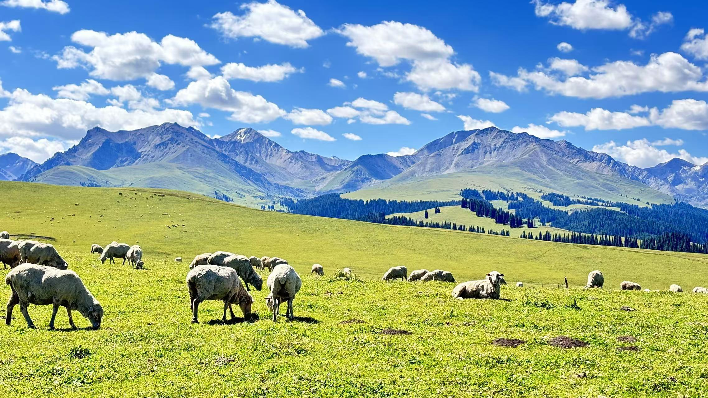

*
*the vast grassland*
*

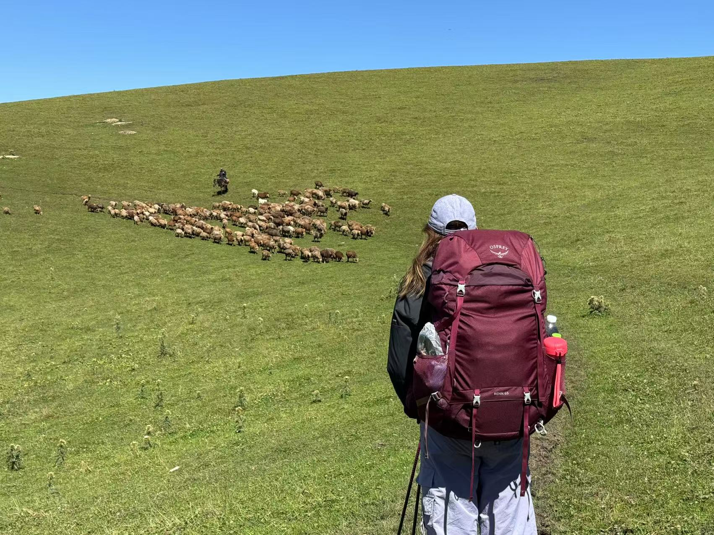

*
*Shocked to unexpectedly encounter a sheep herding!*
*

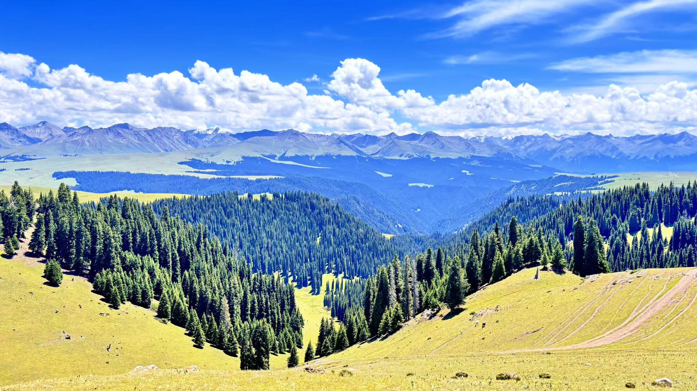

*
*Grasslands, forests, mountains.*
*

We finally arrived at the second campsite before dark. Once again, we were lucky to be invited into a small cabin to sing, dance, drink, and chat. We even received an invitation to a local Kazakh grandmother's house to enjoy big Xinjiang naan with butter and drink fermented mare's milk. This experience was truly unforgettable!!!I swear this is the best Xinjiang naan I've ever had, as it was handmade by the grandmother's family! My sister and I couldn't help but marvel at how lucky we were and how warm-hearted the Kazakh people are!!!!

*
*I had such a great time that day! When I took a selfie and saw my sunburned skin, dry, peeling lips, and hair that hadn't been washed in days, I couldn't help but laugh. My eyes were filled with exhaustion, but also with surprise and satisfaction.*
*

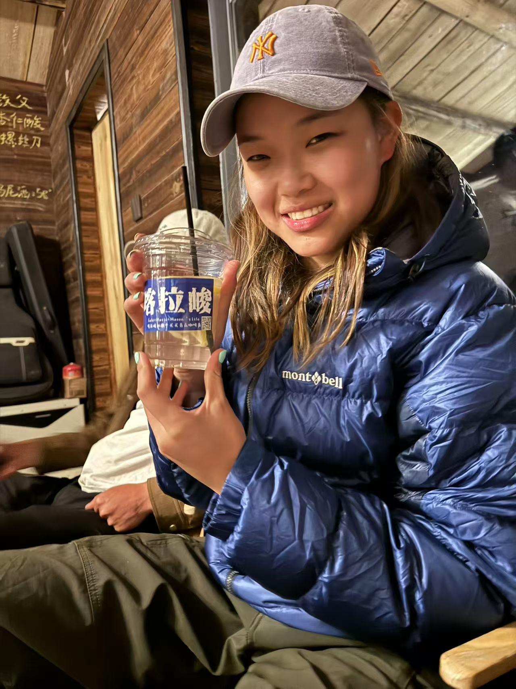

*
*Taking a photo with the lemon tea featuring Kalajun! Yes, they were drinking alcohol while I was sipping on lemon tea.My eyes were laughing so much that you could barely see my eyeballs, even though they’re not very big to begin with—hahaha!*
*

The next morning, we said our goodbyes to our Kazakh friends, even though some of them were still asleep from last night’s festivities. We had such a great time! This day was quite intense, with steep and lengthy uphill and downhill trails. It was so hot that my sister and I decided to wear flip-flops for the climb—it was really exhausting!!

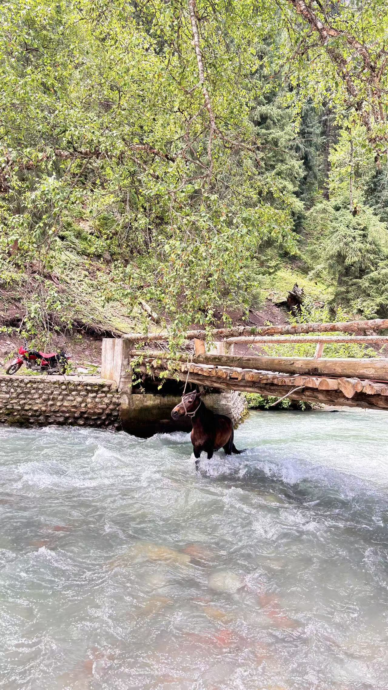

*
*Along the way, we came across a little horse in the river. A nearby Kazakh guy explained that it was using the cold water to heal itself.*
*

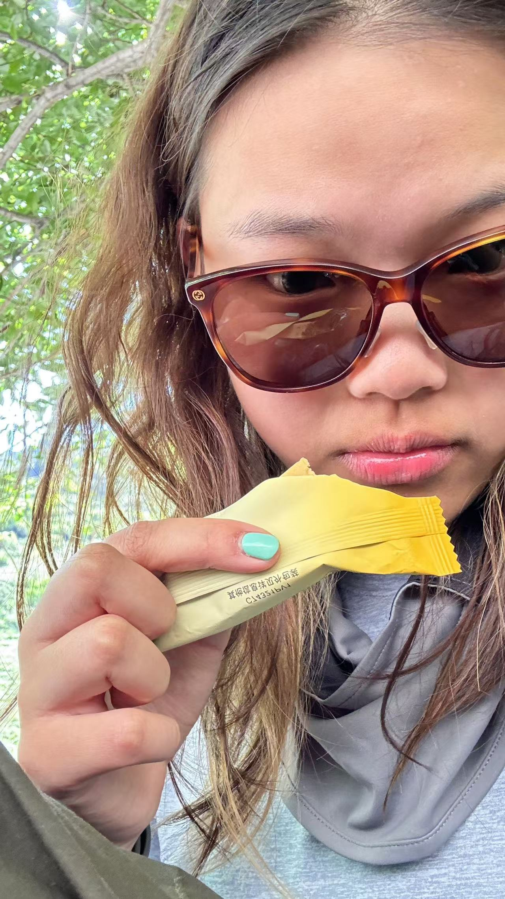

*
*After descending a steep and long hill, we sat down to rest. I desperately needed a protein bar to regain my energy while checking out my sunburned, painful skin and lips—they looked pretty haggard.*
*

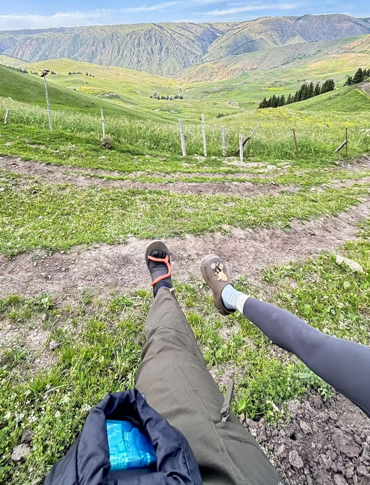

*
*Climbing uphill under the blazing sun was exhausting and super hot. We switched to flip-flops. Isn’t that hilarious? Hahaha!*
*

We finally reached our destination, and the scenery along the way was beautiful. Although we were extremely tired, seeing the stunning views made it all worthwhile. In the end, we came across a humorous road sign with a distinctly Chinese flair—it was definitely worth remembering!

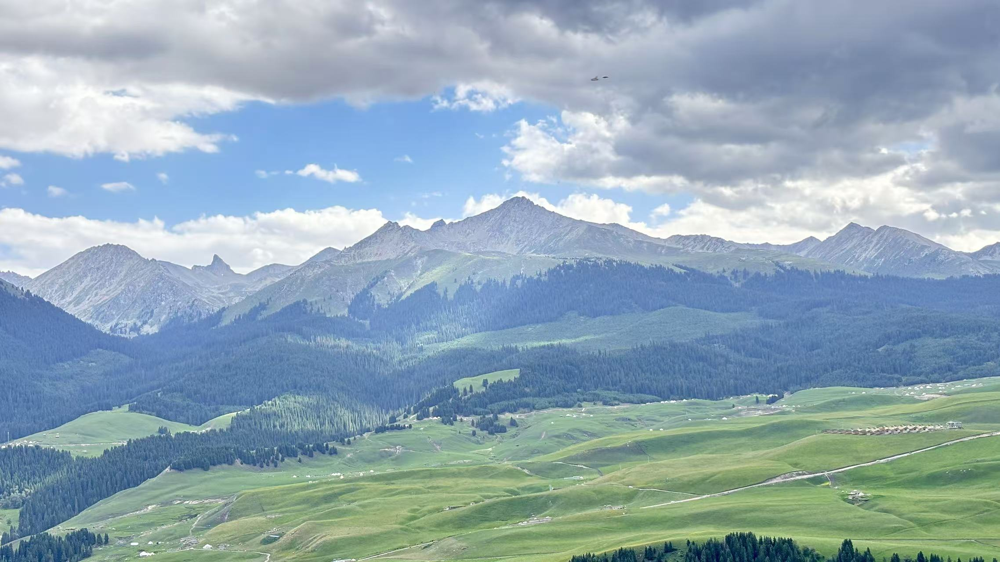

*
*Even though the weather wasn’t great at the time, seeing the rolling grasslands in the distance filled me with satisfaction.*
*

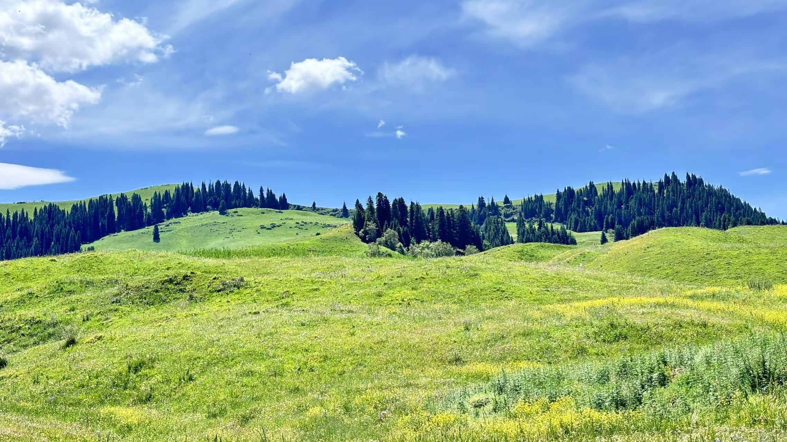

*
*As we descended, the weather improved a bit, and the landscape looked like a huge slice of pure matcha cake.*
*

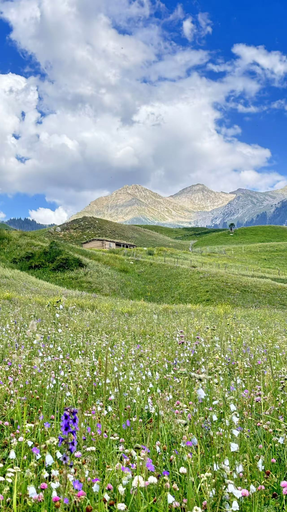

*
*Wildflowers blanketed the grasslands, while in the distance, the sun cast a golden glow on the mountains.*
*

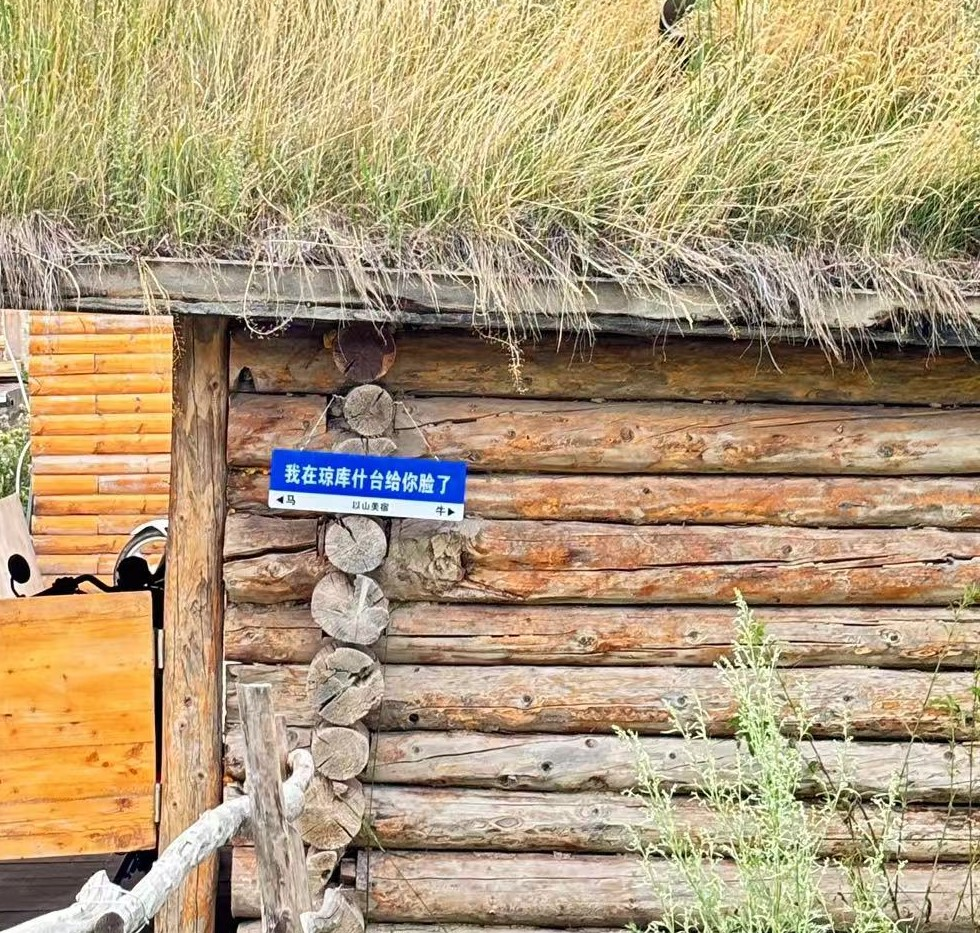

*
*This was an unexpected encounter on the road from Qiungkushtai Village to the starting point of the Wusun Ancient Trail—a very cute and interesting sign with a distinct Chinese characte!haha！*
*

# ending
The three-day, two-night heavy-load trek around Kalajun Grassland was exhausting and hot, but incredibly joyful. We witnessed the starry sky over the grasslands, snow-capped mountains, and grazing cattle and sheep, all while experiencing the warmth and kindness of the Kazakh people. Every memory of being invited by my Kazakh friends is unforgettable. I used to boast to my friends about the activities of the Kazakh people depicted in the drama "To the wonder" and now I’ve experienced them myself. Life is meant for experiences, and I truly lived it on the Kalajun Grassland!

I want to express my heartfelt thanks to the warm-hearted Kazakh friends who invited us along the way, the fellow backpackers we encountered, and my sister who accompanied me on the trek. Your presence made this hiking experience even more exciting and joyful!

**Do good,feel good.**

**Thank god and everyone, of course including myself again.**