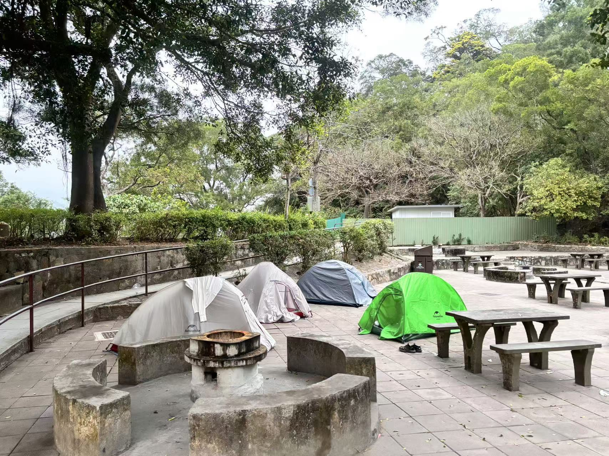
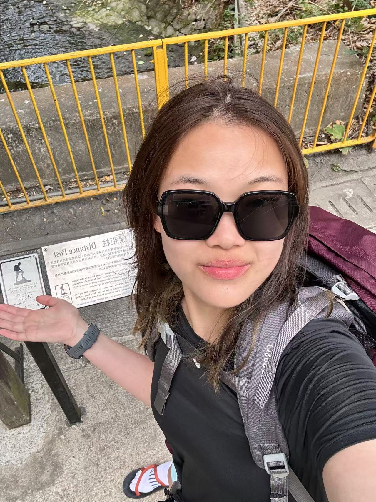

<!DOCTYPE html>
<html lang="en">
<head>
<meta charset="UTF-8">
<meta name="viewport" content="width=device-width, initial-scale=1.0">

</head>
# MacLehose Trail
-Hongkong, China

-2024 0223-0227

-100至110km

-backpacking

# Introduction

The MacLehose Trail is a 100-kilometer long-distance hiking trail that traverses the New Territories in Hong Kong. It is one of the most famous trails in the region, offering stunning views of the coastline, lush forests, and diverse wildlife.Honestly, this is my first long hike with heavy loads. When I made this decision, it took me a lot of courage and energy to prepare.Just do it first hahaha, whatever.

# Hiking

On the first morning, as I passed through the customs, I was carrying a heavy backpack weighing nearly 20 kilograms. Seeing this silhouette, can you imagine how I felt like a total badass at that moment?!? It was like having a personal mountain on my back, and I was the coolest Sherpa you've never met.

*
*On the first morning, passing through the customs with a mountain on my back.*
*

The first section of the MacLehose Trail starts with a stretch of road, making it feel like an ordinary stroll. However, due to Hong Kong's geographical location, even in February, the weather is a bit hot. With a heavy backpack on, I was already sweating slightly. Yet, encountering beautiful scenery along the way, I couldn't resist the urge to take a few selfies hahh.

*
*A slight sheen of sweat all over, my face says it all—feeling pretty good at the moment.*
*

Finally, I arrived at the most beautiful spot of the entire journey—Po Pin Chau. Technically, it's not included in the official 100km of the MacLehose Trail, but that didn't matter to me. To reach the highest point of Po Pin Chau, it's a journey of going down and then up again. I made the very wise decision to leave my heavy backpack in a safe place and continue to Po Pin Chau lightly packed.

Standing on Po Pin Chau, with a gentle breeze blowing, I closed my eyes and listened carefully to the sound of the waves crashing against the rocks. It was a moment of pure serenity and joy.

*
*The scenery of Po Pin Chau ranks in my top three along the MacLehose Trail.*
*

After nearly seven hours of hiking, I finally reached the first campsite near Ham Tin Wan. I had heard tales of the audacious wild boars in the area that would snatch food right from hikers' bags. True to the rumors, a wild boar snatched a backpack from a hiker just five or six meters away from me. He had to shout and wave his hiking pole to scare it off. To be honest, I had a hard time falling asleep at that night. The grunts of wild boars, the howling sea breeze, and the occasional sand falling from above my tent made for a challenging night, especially for someone with a bit of a cleanliness obsession. But I knew cleanliness was a luxury in the outdoors, so I just had to endure it. 

Adding to the misfortune, my throat began to ache severely, similar to when I hiked in the scorching heat of Beijing. It seemed my oral mucosa was damaged again, making it hard to swallow even water. I was even contemplating giving up if the pain persisted, as health comes first. That night, my mood was a mix of worry and defiance.

*
*The sunrise at Ham Tin Wan was obscured by the poor weather at morning.*
*

The second day's trek was more grueling than I had anticipated: over 20 kilometers long, with a climb of more than 1500 meters, all while lugging heavy gear under a scorching sun, which led to hiking in the night. This was my first time having to traverse by night since the Dong Ling Mountain, not by choice. 

Thankfully, my teammates were supportive and dependable. Even though we didn't reach the Ma On Shan campsite until after ten o'clock, I felt a great sense of relief and a small amount of gratification for having conquered my fears. I slept comfortably that night, free from the disturbances of wild boars, with less wind and my body utterly exhausted. It turned out to be the most restful night of the entire trip!

*
*You can tell I was sweating a lot by the way my hair looks.*
*

*
*The night view of Hong Kong taken from the top of Ma On Shan.*
*

On the third day, we set off early and passed the M100 sign at around 2 p.m., marking 50 kilometers. Then we entered Lion Rock Country Park. At a viewing platform, I witnessed a beautiful sunset that even offered a view of Victoria Harbour. However, on a downhill section, I slipped and fell, resulting in three abrasions on my leg. Fortunately, I didn't hurt my knee or worse. Thanks to goodness. That wasn't the worst of it; in the following hours, I encountered the biggest challenge of this hike, if not ever. It's still frightening to recall, which also explains why I now refuse any routes that might involve night hiking. 

Two inexperienced female hikers walked heavily loaded in a deserted forest park after dark, with the occasional sounds of monkeys and possibly wild boars around, and perhaps seeing the glowing eyes of animals if you looked up. I can't describe the tension and fear of that moment through words now, and I really don't want to talk about it. But thankfully, we arrived at the campsite unscathed. I learned a lesson from this experience and certainly developed a psychological aversion to night hiking. I accept my own insignificance and fear, so I now refuse all routes that might involve night hiking.

*
*The sunset at Lion Rock viewing platform.*
*

On the third night, we arrived at the Shek Mun barbecue campsite and quickly cooked noodles for dinner. We met a group of friendly foreigners who were barbecuing and singing a few meters away from us, and they kindly offered us chicken wings and other delicious food. However, fearing diarrhea, we politely declined their generosity. The night was also restless because we heard that some companions spotted wild boars, and with a trash can nearby, it was likely that the wild boars would come looking for food. 

Perhaps due to my fear and exhaustion that day, I slept soundly. The next morning, around six or seven, we were awakened by the enthusiastic greetings of some elderly locals, whose Cantonese we couldn't understand but whose warmth and loudness were unmistakable. We quickly packed up, and I checked my leg injuries, once again grateful that I hadn't hurt my knees or joints. Although it was painful, it was bearable. We hit the road. Having learned from the previous day's night hike, I set off quickly on my own that day. I traversed mountains and ridges and eventually arrived at the final campsite by five o'clock.

*
*Only the four of us were camping, and the site was quite spacious.*
*

*
*Sooooo lucky!It's just a flesh wound.I must be a person with a strong will.*
*

*
*I can't help but lie down and enjoy the gentle breeze.*
*

The last day's journey was all cement ways, and it felt like my feet were about to smoke from all the walking, so I decided to switch to sandals. Sorry, I'm not advertising, but honestly, Montbell's sandals are incredibly comfortable. The four of us chatted as we walked, and in the last kilometer, we couldn't help but sprint towards the finish line. We made it! We did it! We're awesome!

*
*I'm just a skinny porter. The bag was too heavy, and my feet were too sore.*
*

*
*Standing next to the last marker M200, I was incredibly proud of myself!!!!*
*

# ending

This is my first true long-distance and heavy-load hiking, covering 100km with nearly 20 kilograms of weight on the first day. Even after completing these five days, my hips were bruised, my feet were blistered, and several of my toenails have blood spots from the strain, not to mention the sunburn. But I am completely enamored with long-distance backpacking.

The rewards it has given me far outweigh these physical injuries. It has allowed me to build my willpower, teamwork skills and so on. Most importantly, it has taught me that you can never truly know where your limits are. I have fallen in love with the sense of exploring the unknown and pushing my limits.

In the end, I would like to express my gratitude to everyone who helped me along the way. Your generosity in assisting me when I needed it most has shown me the power of kindness, and I will continue to pass it on. I am also grateful to those whom I was able to help; it was you who taught me that being a kind person is an incredibly joyful and fulfilling experience.

**Do good,feel good.**

**Thank god and everyone, of course including myself again.**

