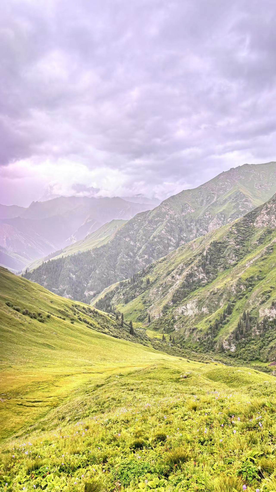
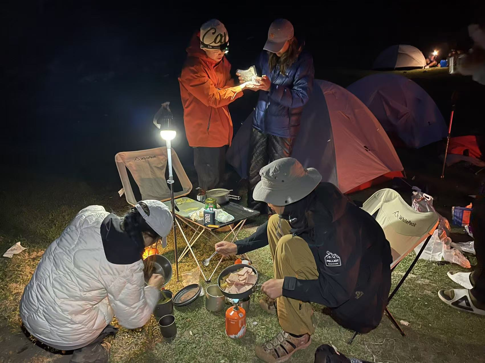

<!DOCTYPE html>
<html lang="en">
<head>
<meta charset="UTF-8">
<meta name="viewport" content="width=device-width, initial-scale=1.0">

</head>

# Wusun Ancient Road Trek
-Xinjiang, China

-2024 0715-0720

-120km

-Lightweight

# Introduction
The Wusun Ancient Road, located in the Tianshan Mountains of Xinjiang, is a historic and scenic trekking route once used by the ancient Wusun people. It offers stunning landscapes, including meadows, forests, snow-capped peaks, and crystal-clear rivers. This challenging trail is popular among hikers for its breathtaking views and the chance to experience the natural beauty and rich history of the region.It’s been on my hiking list for a long time, and I want to go before it becomes fully commercialized.

# hiking
What makes this trek special is that I can hike with a light pack, leaving my heavy gear with the mule team.All I need to carry is my trail running pack. Compared to the heavy load I had in Kalajun, the feeling of trekking with a light pack is unbelievably comfortable!

In the afternoon, we gathered and quickly reached the commemorative stone marking the start of the Wusun Ancient Road. After signing the liability waiver, we set off happily. The weather was overcast, and the temperature was cooler than expected, so we needed to wear hard-shell jackets. Soon, we arrived at the first campsite. I was really excited to be hiking with some amazing cooks this time, so apart from lending a small hand with meals, I got to sit back and admire their culinary skills—hahaha!I swear to improve my cooking skills so I can eat better during future heavy-load camping trips. I swear!

*
*Next to the starting stone of the Wusun Ancient Road, I was filled with joy knowing I was about to fulfill a long-held dream.*
*

*
*I feel so lucky to be camping with friends who are amazing chefs. All I need to do is offer compliments—nothing but praise!*
*

*
*While we were eating, someone suddenly noticed the sunset. I immediately ran up a small hill to catch the view and made a heart gesture.*
*

The intensity of the second day was beyond my expectations. After climbing one mountain, I had to climb another. While crossing a pass, I decided to take a shortcut instead of following the regular path, scrambling over large rocks to reach the top. Fortunately, I arrived safely at the campsite, but looking back, I feel a bit scared. I learned my lesson—no more trailblazing! This time, I was very lucky not to get injured. 

The weather changed dramatically with strong winds and rain, and at times I felt like I might be blown away. It was a thrilling day but also a bit dangerous. On the bright side, it tested and improved my endurance and adaptability. A real case of blessings in disguise!

*
*After the weather improved, I took this photo, but little did anyone know what I had been through to get there. My pants and shoes were completely covered in mud!*
*

*
*This picture looks like the weather has cleared up, but haha, that’s not the case! It started raining again shortly after. One of the main challenges of the Wusun Ancient Road is the sudden weather changes.*
*

The campsite the next day was right next to the forest, and I was really grateful for a small cabin where I could start a fire to dry my pants and shoes. The weather was pretty bad that night, with rain falling on and off. In the morning, I woke up while a few friends were saying they thought they heard a bear during the night, which left one friend kept awake for a while after that. I was shocked but relieved that I had slept soundly. 

In the wild woods of these mountains, it’s not surprising to encounter bears—just a little side note.When the sun came out, we waited for our tents and clothes to dry in the shade while playing cards before setting off again.

On the third day, the weather was on our side, and we reached the campsite in just over four hours. This gave "the chefs" more time to prepare dinner, which was absolutely delicious! The standout dish was ham stew with potatoes—I swear it was the best meal I've ever had while trekking! We even made sure not to waste a drop of the broth, enjoying it with the Xinjiang naan.After filling our bellies and getting some good rest, we relaxed completely. Unfortunately, I was too hungry to remember to take photos at the time, but without a doubt, that was the best meal I had when hiking all the time!

*
*This stretch of trail was incredibly pleasant to walk, with the snow-capped mountains right in front of me.*
*

*
*When does instant noodles taste the best? During a long-distance trek!*
*

The destination on the fourth day was the stunning Heavenly Lake, the most famous checkpoint along the Wusun Ancient Road. I was really looking forward to seeing the sunlight illuminating the mountains. I’ve always been fascinated by this phenomenon, perhaps because it symbolizes good luck in my mind. 

However, the journey to reach this goal was quite challenging. The weather started to change again, with rain, wind, and a drop in temperature. I was thankful countless times that I had brought a trekking rain jacket instead of relying on a hard shell to face the rain.

When we arrived at Heavenly Lake, it was raining, windy, and chilly. We took refuge in a Kazakh yurt, gathering around the stove to dry our clothes and shoes. Due to the terrible weather, we decided not to cook for ourselves and opted to buy mutton rice from a small shop. To be honest, it wasn't very good—the meager portions of mutton and somewhat tough rice left much to be desired. 

Then I had a lightbulb moment and asked the owner for some lamb soup to mix with it. Just being able to fill my stomach was satisfying enough; I didn’t really care about the taste.

*
*Expensive lamb skewers.Tbh not tasty at all.*
*

*
*The rain and low temperatures created a mystical haze of clouds swirling around the lake.*
*

This day was really tough for all of us. The lower half of my white pants had turned into a black-and-white "landscape painting"—so much mud stuck to them! But fortunately, when we got up at eight the next morning, we were truly blessed to see the sunlight illuminating the mountains!!! I was so excited and snapped a ton of photos. Then we hit the trail again, climbing over the high pass and witnessing the stunning sight of the two lakes side by side.

*
*The sunlight was illuminating the mountains at Heavenly Lake!!!*
*

*
*My valiant sacrifice of white pants.*
*

*
*As the weather cleared, the lake's surface became even more pristine.*
*

*
*A group photo of our trekking team. Each one is a great companion!*
*

*
*This is the view of the snow-capped mountains and lakes in Xinjiang, at an elevation of over 3,000 meters.*
*

*
*I really like this shot from behind because it captures a joyful morning.*
*

*
*Smiling brightly at the viewpoint where I can see both lakes.*
*

When we arrived at the last campsite, the weather was uncooperative, with heavy rain and loud thunder rumbling in the distance. I struggled to fall asleep for over an hour, partly due to fear. I didn't sleep well that night, but fortunately, I felt okay the next day.

*
*The final delicious dinner.*
*

The last day involved a slight descent of only a few hundred meters, but we had to cover nearly 30 kilometers and cross about 40 rivers. Some were shallow enough to wade through, while others had water levels exceeding a meter. 

As for the challenge of the Wusun route, it's widely known online that the toughest part is crossing fifty or sixty rivers. For me, however, the real struggle was dealing with sunburn and exhaustion. So, in the last two to three kilometers, I couldn’t help but start running, giving myself a physical boost; otherwise, I would have felt even more fatigued.

Finally, we reached the finish line, right by the monument. I jumped up for a photo, feeling incredibly proud of myself for pushing my limits. 

I also got to lie in the back of something like a tractor. It was a bit bumpy, but while taking photos, I felt like the coolest person on the Wusun route, haha! Later, when I looked at the pictures, I noticed not only how cool I looked but also the severe sunburn on my skin and my dry, peeling lips. It was nature’s gift to me, albeit one that came with a bit of pain.

*
*Jumping with full happiness.*
*

*
*It's cool, right? Of course yes! Well, if your answer is no ,please don't talk with me, thank you.*
*

*
*This is a photo showcasing the size of the Xinjiang lamb skewer.Only 8 yuan?! Unbelievable!! Plus, they’re super delicious! Highly recommend!*
*

# ending

The Wusun Ancient Road is the longest route I've ever walked, measuring a full 120 kilometers. However, since it wasn't a heavy load trek, the difficulty was significantly reduced. Still, it exceeded my expectations, especially due to the changing weather and the challenging mountain passes. On the other hand, this journey enhanced my endurance, adaptability, and willpower. 

In one sentence, the experience can be summarized as: Eating the tastiest meat, gnawing on the softest naan, drinking the strongest liquor, dancing the happiest dance, singing the most heartfelt songs, basking in the fiercest sun, getting drenched in the coldest rain, enduring the strongest winds, climbing the steepest slopes, fording the deepest rivers, crossing the highest mountain passes, and enjoying the wildest adventures, all while seeing the most beautiful scenery and sharing it with the loveliest people.

**Do good,feel good.**

**Thank god and everyone, of course including myself again.**

